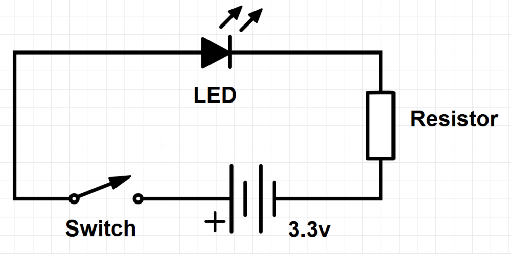

Electronics
***********

Introducing Raspberry Pi's electronic features.

GPIOs
=====

The board.

.. image:: _static/images/gpio-pins.jpg

Symbolically.

.. image:: _static/images/basic-gpio-layout.png

Our project
===========

A Breadboard
============

Columns and rows are linked.

.. image:: _static/images/Breadboard_scheme.svg.png

Light up LED
============

Hook up the following:

* wire: 1 Rpi (3.3v) <-> row 26
* LED: row 26 + (longer leg)  <-> row 25 - (shorter leg)
* resistor: row 25 <-> - col
* wire: - col <-> 6 Rpi (ground)

Blinking LED
============

Python to control BPIO

switch 1 Rpi (3.3v) to 7

Type::

    pi@raspberrypi ~ $ sudo ipython
    In [1]: import RPi.GPIO as GPIO
    In [2]: GPIO.setmode(gpio.BOARD)
    In [3]: GPIO.setup(7, gpio.OUT)
    In [4]: GPIO.output(7, True)
    In [5]: GPIO.output(7, False)

Note we have to be superuser to operate the GPIOs.

Type::

    pi@raspberrypi ~ $ sudo ipython
    In [1]: import RPi.GPIO as GPIO
    In [2]: from time import sleep
    In [3]: GPIO.setmode(GPIO.BOARD)
    In [4]: GPIO.setup(7, GPIO.OUT)
    In [5]: for _ in range(5):
       ....:     GPIO.output(7, True)
       ....:     sleep(1)
       ....:     GPIO.output(7, False)
       ....:     sleep(1)
       ....:

Exercise
========

Put the above into a script and run it.

Resources
=========

* `Source for some of the material <http://www.raspberrypi.org/documentation/usage/gpio/README.md/>`_
* `Quick Reaction Game <http://www.raspberrypi.org/learning/quick-reaction-game//>`_
