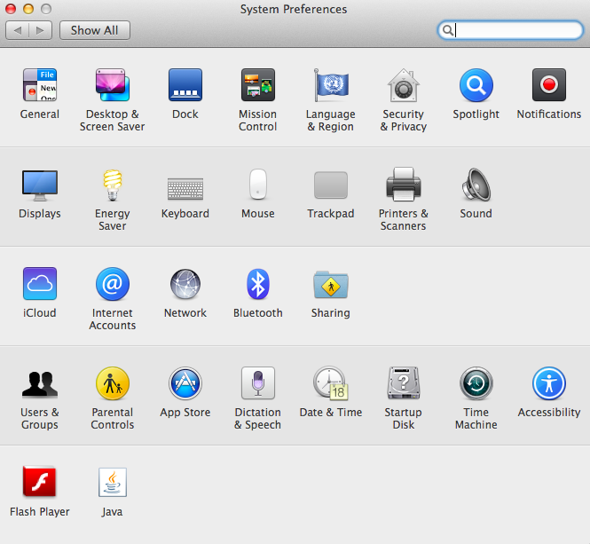

Hardware
********

Components
==========

.. image:: _static/images/rpi-tech-spec.jpg

Exercise
========

Which components do you expect to find in the following computers:

* desktop
* laptop
* mobile
* tablet

What makes the Raspberry Pi special?

System configuration `raspi-config`
===================================

Type::

    sudo raspi-config

and you will get::

    ┌─────────┤ Raspberry Pi Software Configuration Tool (raspi-config) ├─────────┐
    │ Setup Options                                                               │
    │                                                                             │
    │    1 Expand Filesystem             Ensures that all of the SD card          │
    │    2 Change User Password          Change password for the default          │
    │    3 Enable Boot to Desktop/ScratchChoose whether to boot into a de         │
    │    4 Internationalisation Options  Set up language and regional set         │
    │    5 Enable Camera                 Enable this Pi to work with the          │
    │    6 Add to Rastrack               Add this Pi to the online Raspbe         │
    │    7 Overclock                     Configure overclocking for your          │
    │    8 Advanced Options              Configure advanced settings              │
    │    9 About raspi-config            Information about this configura         │
    │                                                                             │
    │                                                                             │
    │                    <Select>                    <Finish>                     │
    │                                                                             │
    └─────────────────────────────────────────────────────────────────────────────┘

Exercise
========

Explore the options that you have.

What are the similarities and differences with this from Mac OSX?

Recap
=====

* The Raspberry Pi is a general purpose computer like any other.
* The main difference is that it exposes a lot that is typically hidden.
* Use `raspi-config` for a convenient way to configure your computer.

We will return to hardware later in the electronics section.
