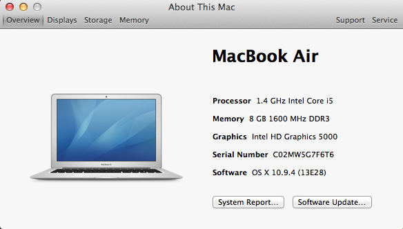

Operating Systems
*****************

Lets explore some of the concepts that an operating system provides.

We will focus on OSs abstractions over:

* Hardware - Both computer and devices
* Processes - An environment for processes to live and die in

Exercise
========

In which level have all of the programs we have run so far existed?

System specs
============

Explore these commands::

    uname -a                      # kernel version & sys architecture
    head -n /etc/issue            # distro name & version
    cat /proc/partitions          # all partitions
    grep MemTotal /proc/meminfo   # total RAM
    grep "model name" /proc/cpuinfo
    hdparm -i /dev/sda
    hwinfo
    lshw

All operating systems provide similar information in some way.

For example on Mac OSX.

Exercise
========

How do you find the same information using the GUI?

Modules & Devices
=================

List the current modules::

    lsmopi@raspberrypi ~ $ lsmod
    Module                  Size  Used by
    joydev                  9096  0
    evdev                  10497  3
    snd_bcm2835            18169  0
    snd_soc_bcm2708_i2s     5486  0
    regmap_mmio             2818  1 snd_soc_bcm2708_i2s
    snd_soc_core          128166  1 snd_soc_bcm2708_i2s
    regmap_spi              1913  1 snd_soc_core
    snd_pcm_dmaengine       5481  1 snd_soc_core
    snd_pcm                81518  3 snd_bcm2835,snd_soc_core,snd_pcm_dmaengine
    snd_page_alloc          5168  1 snd_pcm
    regmap_i2c              1657  1 snd_soc_core
    snd_compress            8136  1 snd_soc_core
    8192cu                551136  0
    leds_gpio               2055  0d

Note the last one `leds_gpio`.

List the current usb devices::

    pi@raspberrypi ~ $ lsusb
    pi@raspberrypi ~ $ lsusb
    Bus 001 Device 002: ID 0424:9514 Standard Microsystems Corp.
    Bus 001 Device 001: ID 1d6b:0002 Linux Foundation 2.0 root hub
    Bus 001 Device 003: ID 0424:ec00 Standard Microsystems Corp.
    Bus 001 Device 004: ID 7392:7811 Edimax Technology Co., Ltd EW-7811Un 802.11n Wireless Adapter [Realtek RTL8188CUS]
    Bus 001 Device 006: ID 1c4f:0016 SiGma Micro
    Bus 001 Device 005: ID 15d9:0a4c Trust International B.V. USB+PS/2 Optical Mouse

Some names are useful. For example you can clearly identify the wireless adapter and mouse. But which one is my keyboard?

Exercise
========

Determine the device that is used as a keyboard.

How can you do this in a way that is guaranteed to work even if naming is ambiguous?

Even if you disconnect all of these and run lsusb (you'd have to be logged in remotely to do this of course) there will still be some usb devices listed. Why? Where are these devices?

The list of modules returned by lsmod is long and confusing. Google some of them and try to identify their purpose. Make sure to know what 8192cu does.

Knowing what you know now, how would you problem solve a usb wireless device not working?

Processes
=========

Commands::

  top
  htop  # requires installing

Process managment on Mac OSX:

Exercise
========

Using `top` or `htop`, identify the process that is running the current terminal.

How do you kill it? Try using your intution combined with documentation, then Google.

Networking
==========

We all have personal networks at home. Mostly we interact with it by setting it up with users and passwords.

Here we introduce some tools to explore our network.

commmands::

    ifconfig
    sudo iwlist wlan0 scan | grep ESSID

Exercise
========

What does the grep command do?
